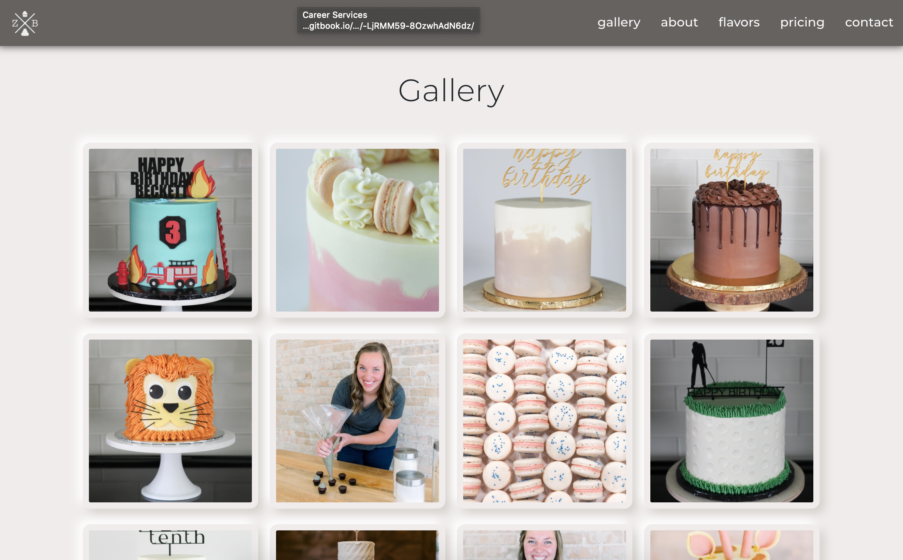
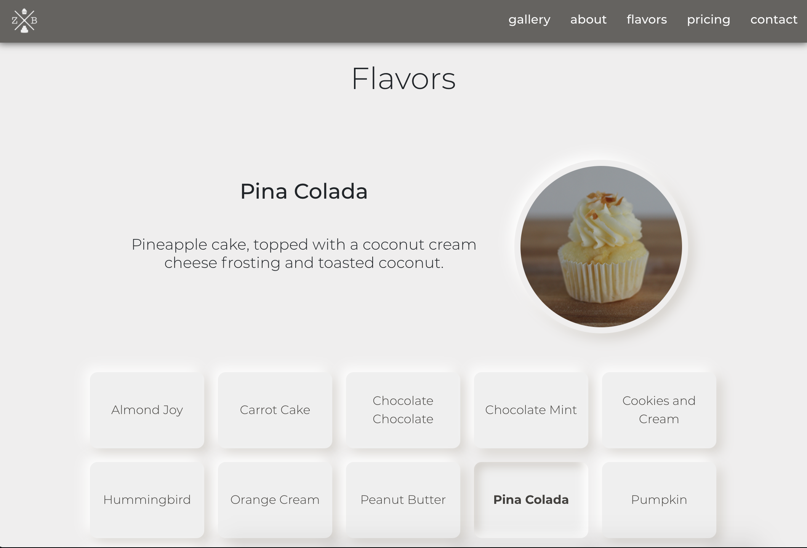
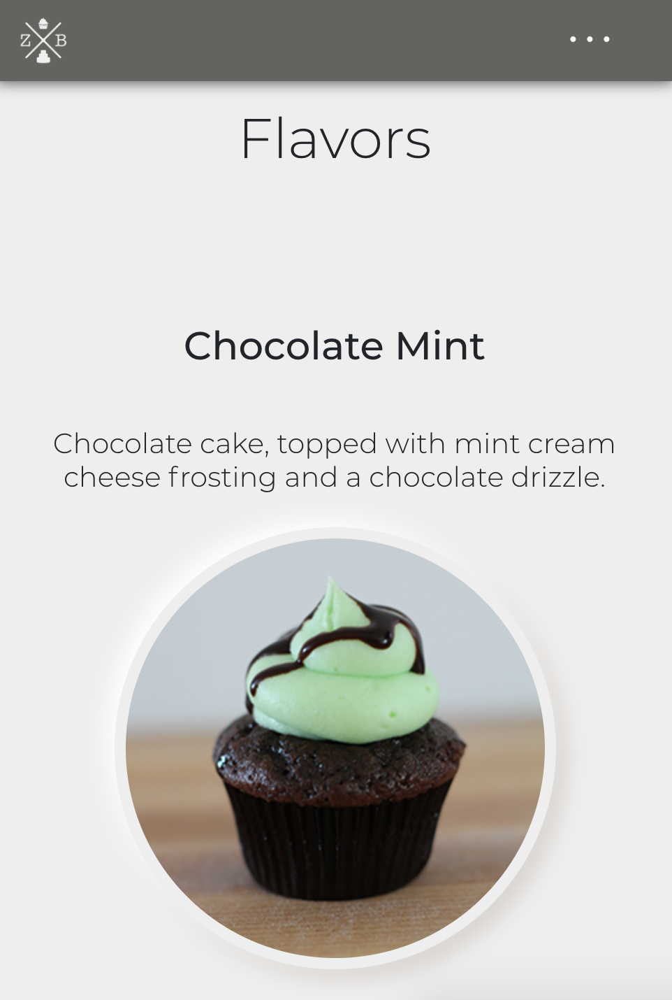

# ZeesyBake

Deployed: http://zeesybake.com/

Repository: https://github.com/aarkitekkt/zeesy-bakes

## Overview
​
The purpose of this application provide general information about ZeesyBake reagarding the company, flavor options, pricing, contact information, and a place to request an order.  This application also displays an image gallery to present the quality and style of work the bakery offers.

### Gallery
​
Instagram API Image Gallery:

Flavor Selector:

Responsive:

Collapsable Nav:

​
### Problem

A challenge faced with this application was creating an live updating image gallery using the Instagram Basic Display API.  Once authorization was obtained and data was able to be retrieved from the instagram user, the variety of media types proved to be a challenge in creating a cohesive gallery.

### Solution
​
The come to a solution I decided first that only single images would be pulled into the gallery.  Once the data is retrieved from the API, a for loop checks each object to determine the media type and pushes the image URL to the gallery array if it is an "image". Videos and multiple image posts are not saved to the gallery array.  Once 12 images are in the gallery array, the useState hook is used to set the gallery array as the new state after which each item in the state is rendered to the page.

## Tech and Features Used​
* React
* Bootstrap
* Node JS
* Bootstrap
* CSS
* Instagram Basic Display API
* React-scroll npm
* Axios

​
## How to use
​
From the landing page, use the navbar or scroll down through each section of the page.  In the 'flavors' section, select a flavor to view a photo and description of each cake and frosting combination. A conctact section provides links to connect to the bakery along with a link referencing a google form to submit order requests.

## Technical Overview​
### Image Gallery

1. When the page is loaded, a function runs to retrieve image data from the ZeesyBake instagram account.  
2. A for loop goes through the returned data and pushes single image media posts and saves the image url to an array until the image count equals 12.  
3. Using the useState hook, this array is set as the new state and then each image in the state is rendered to the gallery.
### Flavor Selector

1. Using the useState hook, an initial state is set with a section description and image of mulitple flavors.
2. An imported .json file provides all of the data for each specific flavor.
3. A flavorlist is generated by using the map method to render a button for each flavor in the imported .json file.
4. When a button is clicked, a function is triggered that obtains the ID of the selected flavor and sets the state of the current flavor to match the selected flavor id. 
5. The new flavor data is then rendered in the section header to display information regarding that flavor to the user.

## Future Development

There are further developments planned for this application that inlude:
1. An integrated order form connected to a database in place of the current order fomr that consists of an external link to a google form.
2. A mailing list input form.
3. A seperate live updating gallery for the cake topper section (@zeesymakes), similar to the existing instagram gallery for @zeesybake.
4. E-commerce integration to allow orders directly from site, or at least a link to externcal e-commerce platform.
5. Calendar for wedding cake availability.